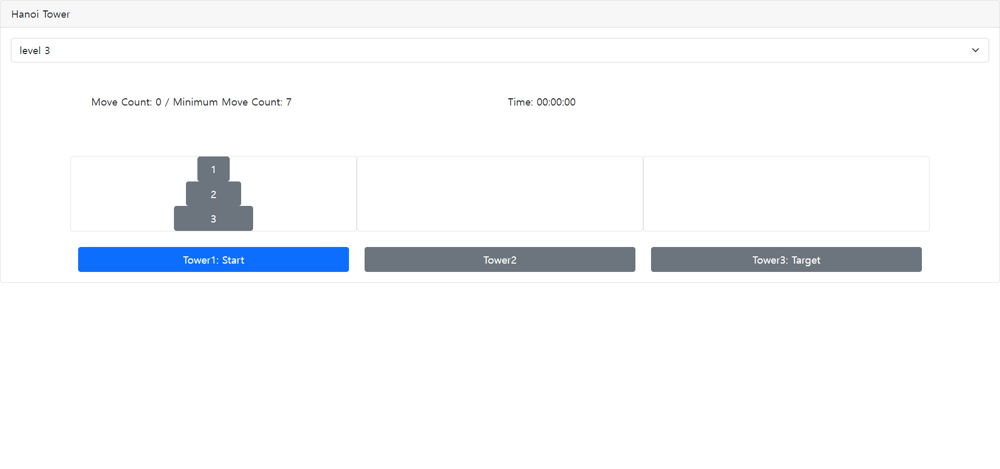

# hanoi-tower-react

> React, TypeScript, Bootstrap


## Install

```bash
npm install --save hanoi-tower-react
```

## Usage

```tsx
import React, { useState } from "react";
import HanoiTower from "hanoi-tower-react";
import { Card } from "react-bootstrap";
import Form from "react-bootstrap/Form";

const App = () => {
  const [level, setLevel] = useState(3);

  const levelOptions = [
    { name: "level 1", value: 1 },
    { name: "level 2", value: 2 },
    { name: "level 3", value: 3 },
    { name: "level 4", value: 4 },
    { name: "level 5", value: 5 },
    { name: "level 6", value: 6 },
    { name: "level 7", value: 7 }
  ];

  return (
    <Card>
      <Card.Header>Hanoi Tower</Card.Header>
      <Card.Body>
        <Form.Select onChange={(e) => {
          const val = e.target.options[e.target.selectedIndex].value;
          setLevel(parseInt(val));
        }} value={level}>
          {levelOptions.map((opt, index) => <option key={index} value={opt.value}>{opt.name}</option>)}
        </Form.Select>
        <HanoiTower level={level} />
      </Card.Body>
    </Card>
  );
};

export default App;

```

### [Example](./example)



### 조작법

- 마우스 드래그앤 드랍
- 키보드
  - 좌, 우 방향키
  - 스페이스 원판 선택 및 원판 드랍

## Structure

- index.tsx
  - main Component
- helper.tsx
  - util&helper functions
- components
  - child components
- modules
  - module classes
- types
  - interfaces

## License

MIT © [](https://github.com/)
